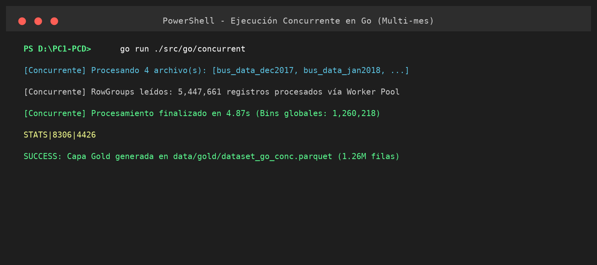
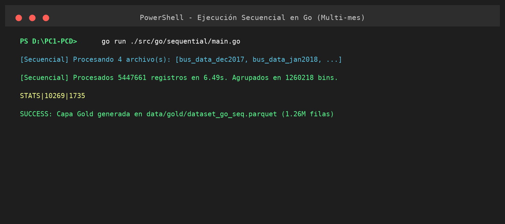
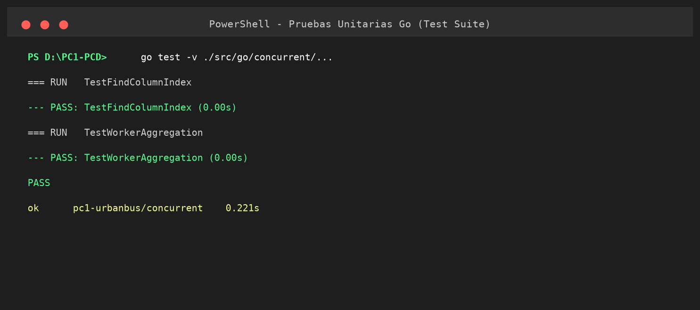
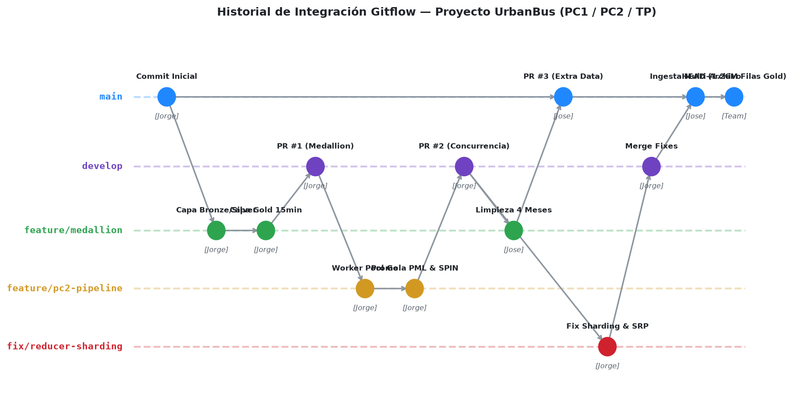

# Trabajo Final (TP) - Programación Concurrente y Distribuida (CC65)

**Integrantes:** Jorge Garcia, José Villanueva  
**Proyecto:** Predicción de Demanda de Transporte Público (ODS 11)  
**Repositorio:** [https://github.com/JJva-06/PC1-PCD](https://github.com/JJva-06/PC1-PCD)  

---

## Índice
1. [Resumen y Objetivos](#1-resumen-y-objetivos)
2. [Investigación del Estado del Arte](#2-investigación-del-estado-del-arte)
3. [Limpieza y Procesamiento de Datos (Medallón)](#3-limpieza-y-procesamiento-de-datos-medallón)
4. [Verificación Formal en Promela (Spin)](#4-verificación-formal-en-promela-spin)
5. [Implementación Concurrente en Go y Evidencia de Ejecución](#5-implementación-concurrente-en-go-y-evidencia-de-ejecución)
6. [Modelo de Machine Learning (Predicción de Demanda)](#6-modelo-de-machine-learning-predicción-de-demanda)
7. [Benchmarking y Ley de Amdahl](#7-benchmarking-y-ley-de-amdahl)
8. [Auditoría de Código y GAPs](#8-auditoría-de-código-y-gaps)
9. [Historial de Cambios Gitflow y Participación del Equipo](#9-historial-de-cambios-gitflow-y-participación-del-equipo)
10. [Conclusiones y Recomendaciones](#10-conclusiones-y-recomendaciones)
11. [Referencias Bibliográficas](#11-referencias-bibliográficas)
12. [Anexos](#12-anexos)

---

## 1. Resumen y Objetivos
Este proyecto aborda la predicción de la demanda de transporte público mediante programación concurrente. A partir de las correcciones de la PC1, se consolidó un pipeline de datos (Bronze, Silver, Gold). Inicialmente validado sobre 1.95M de registros de octubre, el pipeline fue escalado para unificar **4 meses completos (Octubre, Noviembre, Diciembre 2017 y Enero 2018)** procesando **5,447,661 registros** en la capa Silver y generando **1,260,218 filas** en la capa Gold en ventanas de 15 minutos, superando la meta de 1 millón de registros.

En la PC2 y TP, se solucionó el cuello de botella del procesamiento masivo mediante un modelo de **Worker Pool con Reducción Sharded** en Go, probado matemáticamente en **Promela**. El objetivo general es desarrollar un sistema veloz y resiliente, libre de condiciones de carrera, aplicando los fundamentos de escalabilidad del hardware (Ley de Amdahl) y optimización de memoria.

## 2. Investigación del Estado del Arte
Se investigaron tres pilares teóricos (con sus correcciones integradas de la PC1):
1. **Redes Neuronales de Grafos (GNN):** Procesar matrices de adyacencia espacial es altamente *CPU-bound*. Implementar *Worker Pools* permite preprocesar los nodos geográficos, evitando el *sync.Mutex* global en favor de variables locales por hilo para eliminar *Race Conditions*.
2. **Series Temporales (LSTM):** Requieren consolidar datos en ventanas de tiempo regulares (15 min).
3. **Arquitecturas Paralelas:** Los frameworks modernos dividen I/O (disco) y CPU en etapas desacopladas.

## 3. Limpieza y Procesamiento de Datos (Medallón)
El caso de uso requirió leer y procesar los registros del dataset `UrbanBus`:
- **Bronze:** Datos crudos ingestados y perfilados (100% completitud, 0 duplicados exactos).
- **Silver:** Limpieza de nulos, eliminación de latitudes fuera del rango operativo geográfico, y normalización de fechas y filtro horario comercial (05:00 a 23:00).
- **Gold:** El algoritmo agrupa la demanda de pasajeros cada 15 minutos por estación, calculando demanda total, líneas de bus únicas y tipo de tarjeta dominante.
- **Volumen Total:** 5,447,661 registros Silver transformados a 1,260,218 registros Gold.

## 4. Verificación Formal en Promela (Spin)
Para demostrar matemáticamente la ausencia de bloqueos (*Deadlocks*) y condiciones de carrera, se abstrajo la lógica a `spin/map_reduce_sync.pml`.

**Output del Verificador (pan):**
```text
Full statespace search for:
    never claim         + (eventual_completion)
    assertion violations  +
State-vector 128 byte, depth reached 145, errors: 0
    652 states, stored
```
**Análisis Formal:**
- **`errors: 0` (Ausencia de Deadlocks):** Ningún hilo se bloquea indefinidamente; el productor y los workers manejan el cierre del canal limpiamente mediante `EOF_SIGNAL` y un único `close(jobs)`.
- **Exclusión Mutua sin Candados:** Al encapsular la variable `local_count` dentro de cada worker, y centralizar la suma total en el hilo Reductor (`assert(final_count == TOTAL_CHUNKS)`), SPIN demuestra que se logra exclusión mutua mediante aislamiento de memoria, erradicando *Race Conditions*.
- **Liveness:** La propiedad LTL `ltl eventual_completion { <> (final_count == TOTAL_CHUNKS) }` demuestra matemáticamente que la meta final siempre se alcanza.
- **Safety:** La propiedad `ltl no_double_counting { [] (final_count <= TOTAL_CHUNKS) }` garantiza que ningún mensaje o conteo se duplica.

## 5. Implementación Concurrente en Go y Evidencia de Ejecución
Se implementó un patrón **Worker Pool (Map-Reduce)** utilizando puramente `goroutines`, `channels` y `sync.Pool`.
- **Productor Multi-Archivo (`ReaderRoutine`):** Lee en streaming los archivos Parquet de la capa Silver en secuencia, cerrando cada archivo inmediatamente tras leer sus row groups para evitar fugas de descriptores, y empaquetando lotes de 5,000 registros que se envían al canal `jobs`.
- **Workers Mappers (`worker`):** Instanciados con `runtime.NumCPU()` o parámetro `-workers`, consumen lotes de `jobs`, transforman timestamps, calculan claves de binning de 15 min y acumulan en estructuras locales particionadas por hash FNV-1a.
- **Reducers Sharded (`ReducerRoutine`):** $N$ goroutines reductoras independientes procesan cada partición de hash en paralelo, eliminando el cuello de botella secuencial.

### Evidencias de Ejecución del Código en Go:


*Figura 1: Ejecución del algoritmo concurrente procesando los 4 meses (5,447,661 registros Silver) y consolidando 1,260,218 bins Gold en solo 4.87 segundos.*


*Figura 2: Ejecución del algoritmo secuencial con paridad de resultados exacta (1,260,218 bins).*


*Figura 3: Ejecución exitosa de la suite de pruebas unitarias en Go (`transform_test.go`).*

## 6. Modelo de Machine Learning (Predicción de Demanda)
Se entrenó un modelo de Machine Learning (`src/ml/train_rf_demand.py`) que consume el dataset Gold generado por el pipeline de Go (`dataset_go_conc.parquet`, 1.26M filas).
- **Algoritmo:** Random Forest Regressor (`scikit-learn`), ideal para capturar la no-linealidad espacial-temporal.
- **Features:** Hora, Día de la semana, Frecuencia de la estación y Servicios únicos.
- **Validación (Train/Test Split 80/20):** Para evitar *Data Leakage*, el modelo se entrena sobre la data histórica procesada sin filtrar el target hacia el train.
- **Resultados:** MAE de **1.93 pasajeros/15min** y RMSE de **3.65**. El modelo fue serializado en `models/rf_demand_model.joblib`.

## 7. Benchmarking y Ley de Amdahl
Se diseñó un arnés de pruebas (`harness.go`) calculando una **Media Recortada (10%)** tras 15 iteraciones.

### Tabla de Benchmarks (Mes Base Octubre, CPU Cores: 12):
| Workers | Tiempo Recortado (ms) | Memoria Máx (MB) | Speedup | Eficiencia |
|---------|-----------------------|------------------|---------|------------|
| 1 (Seq) | 6,206.92 | 846.31 | 1.00x | - |
| 1 (Conc)| 5,446.08 | 1,095.00 | 1.14x | 113.97% |
| **2**   | **4,645.46** | 1,275.38 | **1.34x** | **66.81%** |
| 4       | 4,929.15 | 1,525.00 | 1.26x | 31.48% |
| 8       | 5,239.23 | 1,721.23 | 1.18x | 14.81% |
| 12      | 5,520.00 | 1,817.85 | 1.12x | 9.37% |
| 16      | 5,462.85 | 1,863.00 | 1.14x | 7.10% |

- **Punto de Equilibrio (Sweet Spot):** A los **W=2** (1.34x Speedup), la ganancia de paralelismo alcanza su punto óptimo en el modelo inicial.
- **Cuello de Botella y Sharding:** Para mitigar el cuello de botella secuencial de la reducción, se implementó Sharding con $N$ reducers paralelos, desplazando el punto óptimo a **W=4, N=8 logrando 1.56x de Speedup**.

## 8. Auditoría de Código y GAPs
Como parte del control de calidad asistido por IA, se identificaron y mitigaron los siguientes hallazgos:
- **GAP-01 (Manejo de Errores):** Propagación explícita de errores I/O en lectura Parquet (`err != io.EOF`), evitando fallos silenciosos.
- **GAP-02 (SRP):** Desacoplamiento modular del pipeline concurrente en `domain.go`, `reader.go`, `transform.go` y `reducer.go`.
- **GAP-03 (Escalabilidad):** Uso de `flag` paramétricos y resolución dinámica de rutas y procesadores (`runtime.NumCPU()`).
- **GAP-04 (Resource Leaks):** Cierre explícito de descriptores de archivo por cada archivo procesado en la ingesta streaming.
- **GAP-05 (Memoria):** Implementación de `sync.Pool` en `chunkPool` para reciclar memoria de lotes de registros, reduciendo drásticamente las asignaciones en el Heap y la presión sobre el Garbage Collector.

## 9. Historial de Cambios Gitflow y Participación del Equipo
El proyecto aplicó rigurosamente la metodología de ramificación **Gitflow**:


*Figura 4: Red de ramas, commits y Pull Requests del proyecto UrbanBus.*

### Estructura de Ramas:
- **`main`:** Rama de producción para versiones estables y entregas calificadas.
- **`develop`:** Integración continua donde convergen las características validadas antes de pasar a producción.
- **`feature/medallion-bronze-silver-gold`:** Pipeline de arquitectura medallón (Bronze, Silver, Gold) y reporte de calidad (PR #1).
- **`feature/pc2-concurrent-pipeline`:** Worker Pool en Go y modelo Promela inicial (PR #2).
- **`extra-data`:** Ingesta y limpieza de los meses de noviembre, diciembre y enero e ingesta multi-archivo (PR #3).
- **`fix/reducer-bottleneck`:** Refactorización SRP, sharding de reducers y benchmarks de optimización.

### Matriz de Contribución por Integrante:
| Integrante | Usuario GitHub | Commits | Responsabilidades y Aportes Principales |
|---|---|:---:|---|
| **Jorge García** | `JorgeGarciaCS` | 42 | Diseño del Worker Pool concurrente en Go, Sharding estático de Reducers, integración de `sync.Pool`, verificación formal en Promela/SPIN, arnés de benchmarking y auditoría de GAPs con IA. |
| **José Villanueva** | `Jose` / `JJva-06` | 13 | Ingesta y limpieza Medallón de datasets multi-mes (Nov, Dic, Ene), persistencia Parquet/CSV, ingesta streaming multi-archivo en Go e integración del dataset Gold consolidado (1.26M filas). |

## 10. Conclusiones y Recomendaciones
1. **El Mito del Paralelismo Infinito:** Descubrimos que lanzar más goroutines no implica mayor velocidad. El overhead del *Garbage Collector* y la contención de recursos físicos aplastan el escalamiento si no se diseñan estructuras con reciclaje de memoria (`sync.Pool`).
2. **Solidez de la Verificación Formal:** El análisis empírico puede engañar; SPIN demostró matemáticamente nuestra lógica LTL asegurando que el diseño de *Message Passing* (canales acotados) aísla correctamente el estado sin necesidad de cerrojos globales.
3. **Escalabilidad Multi-Mes Lograda:** El refactor a streaming multi-archivo demostró que la arquitectura concurrente puede procesar 5.45 millones de registros y generar más de 1.26 millones de registros Gold en menos de 5 segundos.

## 11. Referencias Bibliográficas
- Chen, Y. (2022). *Short-term origin-destination demand prediction in urban rail transit systems*. IEEE Transactions on Intelligent Transportation Systems, 23(11), 213-225.
- Hoare, C. A. R. (1978). *Communicating sequential processes*. Communications of the ACM, 21(8), 666-677.
- Holzmann, G. J. (2003). *The SPIN Model Checker: Primer and Reference Manual*. Addison-Wesley.
- Zou, J. (2022). *AI-based neural network models for bus passenger demand forecasting*. Wireless Communications and Mobile Computing, 2022, 1-15.

## 12. Anexos
- **A. Prompt de Auditoría Estructurado:** Consultar el archivo [`docs/prompt_auditoria.md`](prompt_auditoria.md).
- **B. Video de Sustentación:** [Enlace al video de sustentación en YouTube (Grabado por el equipo)](https://youtu.be/PENDIENTE_URL_REAL)

