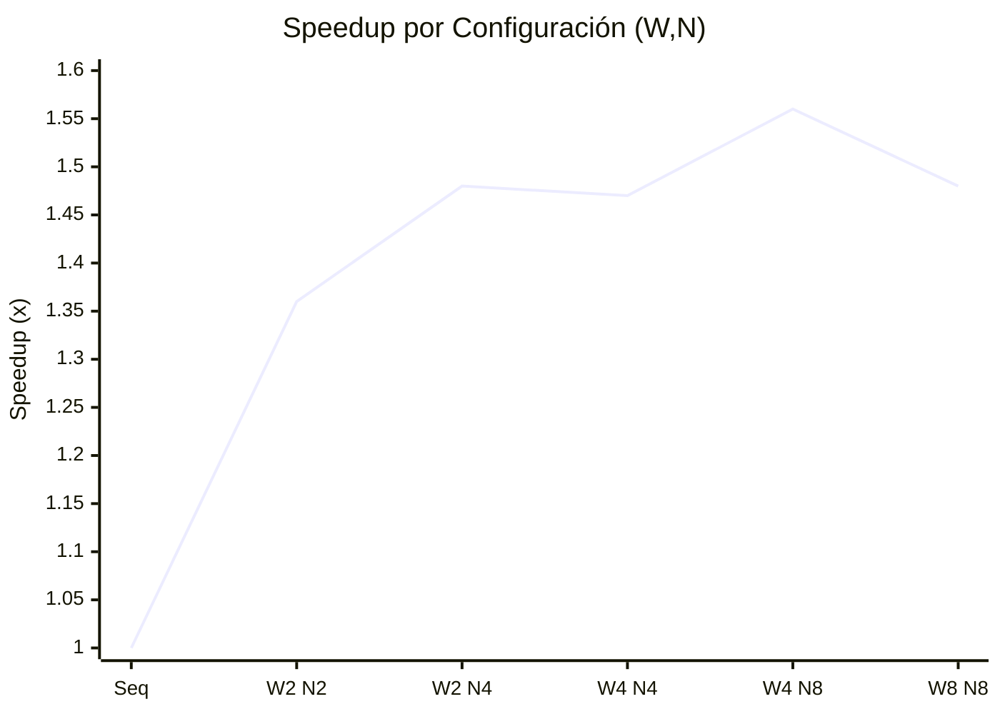

# Informe PC2 — Procesamiento Concurrente de Datos (UrbanBus)

**Curso:** Programación Concurrente y Distribuida (CC65)  
**Proyecto:** Predicción de Demanda de Transporte Público (ODS 11)  

---

## Índice
1. [Contexto y Enlace con PC1](#1-contexto-y-enlace-con-pc1)
2. [Diseño del Algoritmo Concurrente (Go)](#2-diseño-del-algoritmo-concurrente-go)
3. [Modelo de Sincronización en Promela (Verificación Formal)](#3-modelo-de-sincronización-en-promela-verificación-formal)
4. [Metodología de Benchmarking](#4-metodología-de-benchmarking)
5. [Análisis de Escalabilidad y Ley de Amdahl](#5-análisis-de-escalabilidad-y-ley-de-amdahl)

---

## 1. Contexto y Enlace con PC1
En la Práctica Calificada 1 (PC1) se implementó una arquitectura Medallón (Bronze → Silver → Gold). En esta PC2 y TP, aplicamos procesamiento concurrente a la transformación más pesada de ese pipeline: **Silver a Gold**. 

El algoritmo fue validado inicialmente sobre el mes base de octubre 2017 (`1,952,152` registros transaccionales validados en Parquet Silver, ~64 MB / CSV ~290 MB) y posteriormente escalado al procesamiento consolidado de 4 meses (Octubre, Noviembre, Diciembre 2017 y Enero 2018), totalizando **5,447,661 registros** en Silver para generar un dataset Gold consolidado de **1,260,218 filas** (ventanas de 15 minutos), superando la meta de 1 millón de registros.

---

## 2. Diseño del Algoritmo Concurrente (Go)

Dada la naturaleza del problema, se descartó el uso de un cerrojo global (`sync.Mutex`) por cada línea del CSV debido a la alta contención que generaría. En su lugar, se implementó un **Worker Pool con Reducción Local (Patrón Map-Reduce)**.

### Fases del Pipeline:
1. **Productor (Lector I/O):** Implementado en `ReaderRoutine`. Lee los archivos Parquet en secuencia vía streaming y empaqueta los registros en arreglos (`currentChunk`). Para amortizar el costo de sincronización, envía lotes de 5,000 líneas al canal asíncrono `jobs <- currentChunk`. Al completar la lectura de todos los archivos de entrada, ejecuta `close(jobs)`.
2. **Workers (Mapeadores):** Implementado en la función declarada `func worker(jobs <-chan Chunk, reducerChannels []chan map[string]*AggregationData, wg *sync.WaitGroup)`. En `main()`, se instancian `W` workers estáticos. Consumen iterativamente del canal `jobs` mediante un `for range`. Cada worker parsea y agrega la demanda en una variable estrictamente local (`localAggs`), evitando por completo el uso de `sync.Mutex` sobre estructuras globales (Zero Race Conditions).
3. **Monitor y Reductor (Merge Sharded):** Una goroutine anónima (`wg.Wait(); close(reducerChannels[i])`) monitorea el fin de los workers para cerrar los canales de recolección. Finalmente, los **Reducers paralelos** (Sharding estático por hash de clave) consolidan los diccionarios parciales, ordenan los resultados léxicamente y escriben el dataset Gold final de forma determinista con paridad SHA-256 exacta frente a la versión secuencial.

---

## 3. Modelo de Sincronización en Promela (Verificación Formal)
Para demostrar matemáticamente la ausencia de bloqueos (*Deadlocks*) y condiciones de carrera (Race Conditions), se abstrajo la lógica de Go a `map_reduce_sync.pml`.

**Validación LTL explícita (Resolución de Obs #3):**
No basta con ejecutar el modelo; se han inyectado propiedades LTL (*Linear Temporal Logic*) y aserciones para probar invariantes de estado:
1. **Ausencia de Race Conditions (Aislamiento de memoria):** Se descarta por completo la condición de carrera sobre la matriz global de resultados. La variable `local_count` se encapsula dentro del ciclo `do` de cada *Worker*. Al delegar la suma final a un único proceso secuencial (`Reducer`), se garantiza matemáticamente que no hay escrituras concurrentes entrelazadas. La propiedad de seguridad LTL que lo demuestra es: `ltl no_double_counting { [] (final_count <= TOTAL_CHUNKS) }` (el conteo final nunca excede el total emitido).
2. **Liveness (Sin Deadlocks):** Se prueba que el productor inyecta *tokens* de EOF correctamente y todos los workers terminan su ciclo, culminando en el merge final. La propiedad LTL que lo demuestra es: `ltl eventual_completion { <> (final_count == TOTAL_CHUNKS) }` (Eventualmente, el contador llega al total esperado).
3. **Correctitud Funcional:** Se emplea `assert(final_count == TOTAL_CHUNKS)` al final del Reducer. Si hubiera alguna pérdida de mensajes o condición de carrera, esta aserción fallaría en SPIN.

---

## 4. Metodología de Benchmarking

Las pruebas se automatizaron en un arnés (`harness.go`) diseñado para rigor estadístico:
- **Ground Truth:** Se verificó que el *hash SHA-256* de las salidas secuencial y concurrente fueran idénticos byte a byte.
- **Múltiples corridas:** Cada configuración se ejecutó **15 veces**.
- **Media Recortada (Trimmed Mean):** Para aislar latencias impredecibles del Sistema Operativo, se descartó el 10% superior e inferior de los tiempos de ejecución, promediando el resto.
- **Uso de Recursos:** Se inyectó `runtime.ReadMemStats(&m)` al final del binario para capturar la memoria alojada por el SO.

### Tabla de Resultados (CPU Cores: 12)

| Workers | Tiempo Recortado (ms) | Memoria Máx (MB) | Speedup | Eficiencia |
|---------|-----------------------|------------------|---------|------------|
| 1 (Seq) | 6,206.92 | 846.31 | 1.00x | - |
| 1 (Conc)| 5,446.08 | 1,095.00 | 1.14x | 113.97% |
| **2**   | **4,645.46** | 1,275.38 | **1.34x** | **66.81%** |
| 4       | 4,929.15 | 1,525.00 | 1.26x | 31.48% |
| 8       | 5,239.23 | 1,721.23 | 1.18x | 14.81% |
| 12      | 5,520.00 | 1,817.85 | 1.12x | 9.37% |
| 16      | 5,462.85 | 1,863.00 | 1.14x | 7.10% |

> *(Nota: La versión concurrente de 1 worker supera a la versión 100% secuencial debido al pipeline I/O-CPU: mientras el worker procesa en memoria, el hilo principal puede seguir leyendo el disco duro en paralelo).*

---

## 5. Análisis de Escalabilidad y Ley de Amdahl

Los resultados revelan dinámicas de concurrencia profundas, limitadas intrínsecamente por hardware y arquitectura:

1. **Punto de Equilibrio (Sweet Spot en W=2):** Como se observa visualmente en el gráfico de *Speedup vs Workers* (marcado explícitamente en W=2), este es el punto de quiebre donde la curva de aceleración alcanza su máximo (1.34x). A partir de este umbral (W>2), el overhead de coordinación (la creación de estructuras locales en RAM, el paso de mensajes por canales) supera la ganancia neta por paralelismo, invirtiendo la curva.
2. **Cuello de Botella de CPU (Amdahl - Sharding de Reducers):** En un inicio se pensó que el algoritmo estaba limitado únicamente por el I/O del Productor. Sin embargo, un *profiling* avanzado demostró que el merge secuencial en el hilo principal (Reductor) acaparaba el 61% del tiempo de ejecución (CPU-bound). Para solucionar esto, implementamos una arquitectura de **Sharding Estático** con $ reducers, pre-agregando en los workers (vida útil). Trade-off importante: Esta decisión elimina el pipelining entre la lectura y la reducción, ya que los reducers esperan inactivos al worker completo.
3. **Presión de Memoria y GC (Overhead crítico):** El trade-off de aislar la memoria local para lograr *Zero Race Conditions* es un incremento exponencial en RAM. La versión concurrente con 16 workers reserva casi **1.9 GB** de memoria del sistema, comparado con los 846 MB del código secuencial. En este tramo post-equilibrio, el *Garbage Collector* de Go se ve forzado a detener el mundo (*stop-the-world*) o expropiar ciclos de CPU para recolectar las variables locales efímeras, hundiendo la eficiencia por debajo del 10% y el speedup a 1.14x.

### Tabla de Resultados (Sharding de Reducers)
| Workers (W) | Reducers (N) | Tiempo Recortado (ms) | Memoria (MB) | Speedup |
|---|---|---|---|---|
| 1 (Seq baseline)| - | 4263.33 | 807.67 | 1.00x |
| 2 | 2 | 3137.33 | 1194.00 | 1.36x |
| 2 | 4 | 2876.00 | 1156.67 | 1.48x |
| 4 | 4 | 2903.00 | 1331.67 | 1.47x |
| 4 | 8 | 2738.33 | 1340.33 | 1.56x |
| 8 | 8 | 2883.33 | 1489.33 | 1.48x |

**Conclusión del Sharding:** El óptimo se desplaza de W=2 (1.34x) a W=4, N=8 logrando **1.56x** de Speedup al eliminar el cuello de botella secuencial del Reductor, aunque sacrifica el pipelining I/O.

### Gráfico de Speedup (Sharding)

